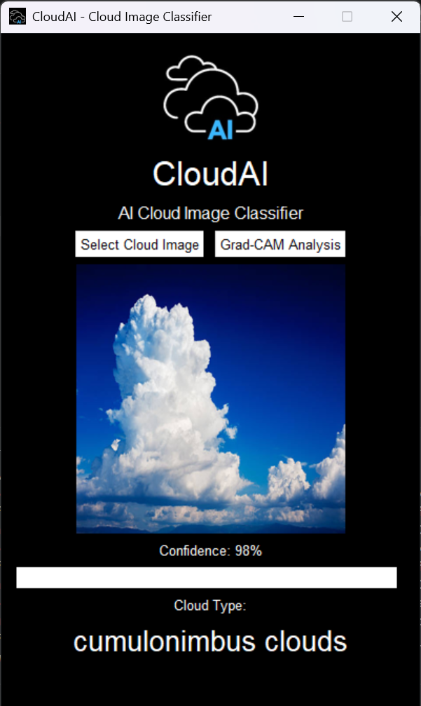
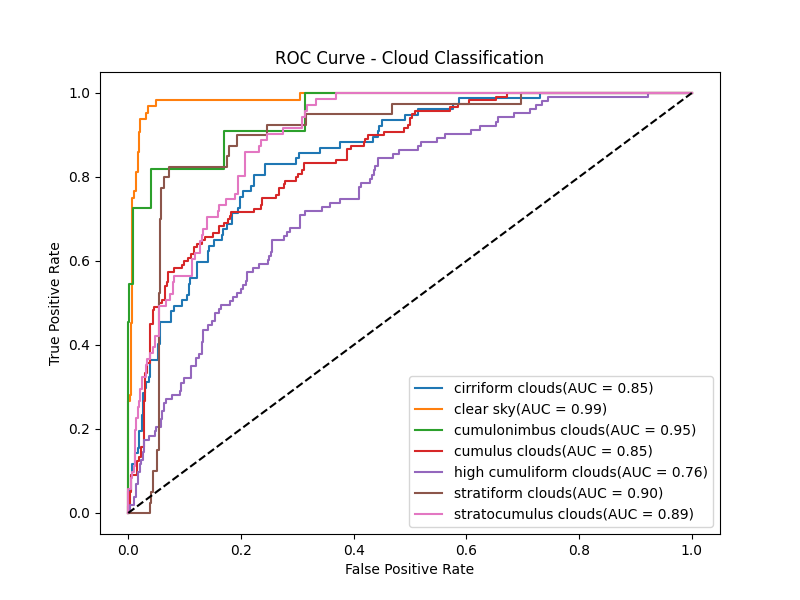
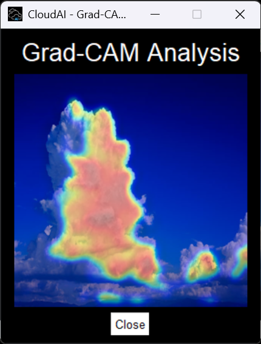

# ☁️ CloudAI — AI Cloud Image Classifier


## App Preview



## Description
> **"Clouds are not objects.
> They are signatures of chaos in the atmosphere."**

CloudAI is a **deep learning–based cloud classification tool** that combines a **Convolutional Neural Network (CNN)** with a **desktop graphical interface** to identify cloud types from sky images.

This project explores how machine learning can extract **visual proxies of atmospheric states** from RGB sky photographs.

---

# 🌍 Scientific Motivation

Clouds are not rigid objects.

They do not obey sharp boundaries, fixed geometry, or deterministic shapes.

From a meteorological perspective, clouds are manifestations of **nonlinear atmospheric dynamics**, driven by:

* turbulence
* convection
* moisture gradients
* radiative transfer
* multi-scale atmospheric interactions

This repository demonstrates how a CNN can **approximate these complex visual patterns**, acknowledging that:

> **uncertainty is a feature of atmospheric systems, not a failure of the model.**

---

# ☁️ CloudAI Application

CloudAI includes a **desktop application** that allows users to classify clouds interactively.

Features:

* Select a cloud image from your computer
* Automatic preprocessing (center crop + resize to **256×256**)
* CNN inference
* Confidence visualization
* Predicted cloud category display

Example interface:

* Image preview
* Confidence score
* Progress bar visualization
* Predicted cloud type

---

# 🧠 Model Overview

The CNN classifies **7 atmospheric categories**:

1. Cirriform clouds
2. Clear sky
3. Cumulonimbus clouds
4. Cumulus clouds
5. High cumuliform clouds
6. Stratiform clouds
7. Stratocumulus clouds

Input images:

```
RGB image
Resolution: 256 × 256
```

---

# 🏗️ CNN Architecture

The model follows a hierarchical **feature extraction → classification** design.

### Feature Extraction

* Conv2D (32 filters)
* MaxPooling2D
* Conv2D (64 filters)
* MaxPooling2D
* Conv2D (128 filters)
* MaxPooling2D

### Classification Head

* GlobalAveragePooling2D
* Dense (128)
* Dense (64)
* Dense (32)
* Dense (16)
* Dense (7, Softmax)

Training configuration:

| Parameter  | Value                    |
| ---------- | ------------------------ |
| Optimizer  | Adam                     |
| Loss       | Categorical Crossentropy |
| Epochs     | 30                       |
| Image size | 256×256                  |

The final exported model is a **lightweight deployment model (~1.44 MB)**.

---

# 📊 Model Evaluation

Overall performance:

| Metric            | Value |
| ----------------- | ----- |
| Accuracy          | ~52%  |
| Macro F1-score    | ~0.48 |
| Weighted F1-score | ~0.48 |

While accuracy appears moderate, it reflects the **intrinsic ambiguity of cloud morphology**, where boundaries between classes are continuous.

---

# 📈 ROC Curves



The model detects **strong visual signatures of convective systems**, particularly cumulonimbus clouds.

---

# 🔥 Grad-CAM Analysis

CloudAI includes **Grad-CAM (Gradient-weighted Class Activation Mapping)** visualization.

Grad-CAM allows users to inspect **which regions of the cloud image contribute most strongly to the CNN prediction**, making the model more interpretable and scientifically transparent.

The heatmap is generated by:

1. Computing gradients of the predicted class score with respect to the final convolutional feature maps.
2. Averaging the gradients to obtain channel importance weights.
3. Producing a weighted combination of feature maps.
4. Overlaying the resulting activation map on the original cloud image.

This feature transforms CloudAI from a simple classifier into an **explainable atmospheric vision system**.

### Features

* One-click Grad-CAM analysis from the GUI
* Automatic heatmap generation
* Real-time overlay visualization
* No temporary image files required

### Example Grad-CAM Visualization



The highlighted regions indicate the areas that most strongly influence the model's prediction.

For example, when classifying **cumulonimbus clouds**, the model often focuses on:

* strong vertical cloud development,
* convective tower boundaries,
* high optical thickness regions,
* cloud-top structures associated with deep convection.

This provides additional confidence that the CNN is learning **physically meaningful visual signatures** rather than relying on arbitrary pixel patterns.

---


# 📁 Project Structure

```
CloudAI/
│
├── dataset/
│   ├── clouds_train/
│   └── clouds_test/
│
├── GUIassets/
│   
│
├── class_labels.json
├── cloud_classifier_model.h5
│
├── train_model.py
├── evaluate_model.py
├── inference.py
│
├── roc_curve.png
├── screenshot.png
├── screenshot_GRADCAM.png
├── CloudAI.py        # main program 
└── README.md
```

---

# ⚠️ Limitations

Cloud classification using RGB images has inherent limitations:

* no vertical atmospheric information
* illumination variability
* strong morphological overlap
* meteorological label ambiguity

Thus, misclassifications often reflect **physical continuity of cloud systems**, rather than purely algorithmic errors.

---

# 🚀 Future Directions

Possible improvements include:

* Temporal CNN / ConvLSTM using cloud evolution
* Satellite multi-spectral imagery
* Integration with meteorological data:

  * humidity
  * CAPE
  * wind shear
* Probabilistic or weakly supervised labeling

---

# ⚙️ Requirements

Run this command to install Python requirements

```
pip install -r requirements.txt
```

---

# 📜 License

MIT License.

This project is open for **research, experimentation, and educational use**.

---

# 🌩️ Final Note

This model does not claim perfection.

It attempts something harder:

to extract structure from **one of the most chaotic visual systems on Earth**.

Clouds are not simple shapes.
They are **visible turbulence**.

CloudAI simply tries to read the sky.

---

**Created by Jovan — 2026**

---


